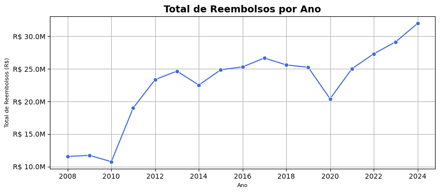
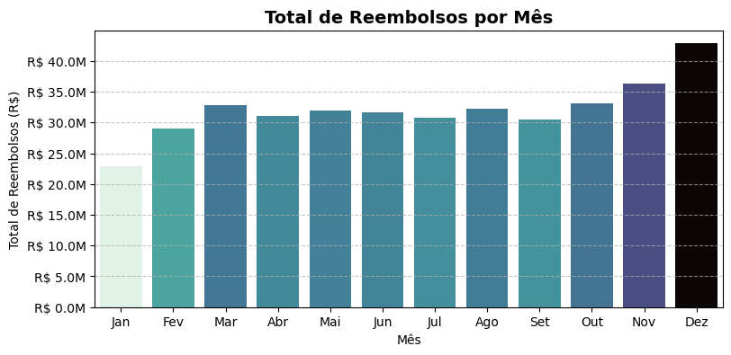
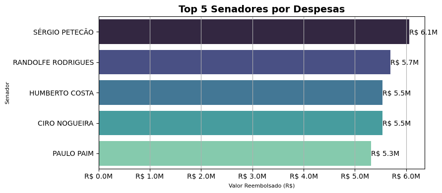
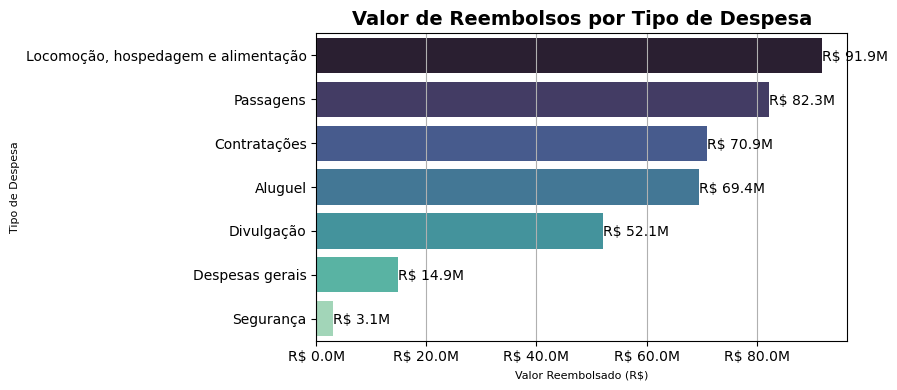
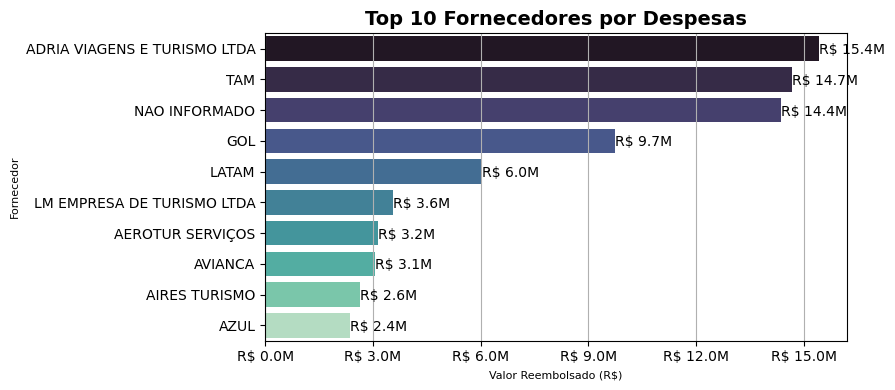

# 📊 Análise de Dados de Reembolso Parlamentar (CEAPS)

Este repositório contém uma **análise exploratória rápida** dos dados de reembolso parlamentar da **CEAPS (Cota para o Exercício da Atividade Parlamentar)** entre os anos de **2008 e 2024**. O objetivo é identificar padrões de gastos dos senadores brasileiros e explorar como os recursos públicos são utilizados.

Os dados foram obtidos diretamente da **API de Dados Abertos do Senado Federal**, garantindo transparência e acessibilidade.

---

## 🚀 Metodologia

1. **Coleta de Dados**  
   - Os dados foram baixados automaticamente da [API do Senado](https://www12.senado.leg.br/dados-abertos).
   - Todos os arquivos CSV de **2008 a 2024** foram carregados e unidos em um único conjunto de dados.

2. **Limpeza e Tratamento**  
   - Remoção de colunas irrelevantes.  
   - Padronização de nomes de fornecedores.  
   - Conversão de tipos de dados para garantir cálculos corretos.  

3. **Análise Exploratória de Dados (EDA)**  
   - Evolução dos reembolsos ao longo dos anos e meses.  
   - Identificação dos senadores que mais utilizaram a cota parlamentar.  
   - Distribuição dos gastos por tipo de despesa.  
   - Análise dos principais fornecedores que receberam reembolsos.  

---

## 📊 Principais Resultados

### 🔹 Valor Total de Reembolsos por Ano

Analisamos a evolução dos gastos ao longo dos anos.

### 🔹 Valor Total de Reembolsos por Mês

Identificamos como os gastos variam ao longo do ano.

### 🔹 10 Senadores que Mais Gastaram

Os 10 senadores com os maiores valores reembolsados foram identificados.

### 🔹 Valor de Reembolsos por Tipo de Despesa

Os gastos foram categorizados para entender quais tipos de despesas consomem mais recursos.

### 🔹 Valor de Reembolso Declarado Dividido por Fornecedor

Analisamos quais fornecedores receberam mais pagamentos ao longo do período analisado.

---

## 📌 Conclusão

A análise revela **padrões significativos** no uso da cota parlamentar ao longo dos anos:

- **Aumento expressivo dos gastos pós-pandemia (2020 em diante)**, superando os anos anteriores de forma notável.  
- **Tendência de maior gasto nos meses de outubro a dezembro**, com **dezembro sendo o mês de maior reembolso**.  
- **Os 5 senadores com mais gastos** são **Sérgio Petecão, Randolfe Rodrigues, Humberto Costa, Ciro Nogueira e Paulo Paim** (analisando seus períodos no Senado pode-se entender melhor esse padrão).  
- **Os principais tipos de despesas** são **locomoção, hospedagem e alimentação**, seguidos por **passagens aéreas** e, em terceiro lugar, **contratações de serviços**.  
- **Os maiores fornecedores** incluem **Adria Viagens e Turismo** e **TAM Linhas Aéreas**, além de um montante expressivo de **R$ 14,4 milhões sem fornecedor identificado**.  

Esses dados reforçam a importância de **transparência e fiscalização no uso dos recursos públicos**, permitindo identificar padrões de gastos e possíveis oportunidades de otimização dos reembolsos parlamentares.

---

## 📂 Dados e Código

- Os dados foram coletados via **API do Senado Federal**.  
- O código-fonte e os notebooks estão disponíveis neste repositório para reprodução e validação.

## 📧 Contato  
📌 Criado por **Lucas Viana Ribeiro**  
💼 Conecte-se no **[LinkedIn](https://www.linkedin.com/in/lucasvrib/)** 

---

🌟 **Se gostou do projeto, deixe uma estrela no repositório!** ⭐  
